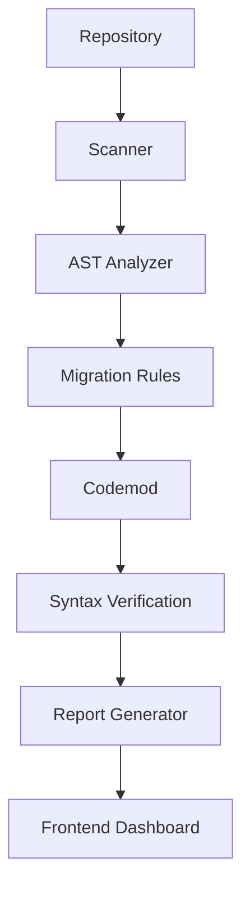

# LUME

[](https://www.python.org/)
[](https://fastapi.tiangolo.com/)
[](https://react.dev/)
[](https://vite.dev/)
[](#license)

LUME is a deterministic developer tool that analyzes Python projects and helps migrate OpenAI Python SDK 0.x usage toward the 1.x client-based API.

## Overview

OpenAI Python SDK migrations can affect imports, global configuration, resource namespaces, asynchronous clients, image and audio APIs, and exception types. A simple search-and-replace often produces incomplete code or misses patterns that only fail at runtime.

LUME maps legacy usage with Python's AST, applies supported deterministic codemods, verifies the transformed source can be parsed as Python, and presents the results in a web dashboard. It is designed to make migration work easier to inspect and review, not to claim semantic correctness automatically.

## Features

- AST-based static analysis of Python source files
- Detection of OpenAI SDK 0.x migration patterns
- Automatic codemod generation with unified diffs for supported rules
- Syntax verification of transformed files using `ast.parse()`
- Per-file verification results and migration summaries
- Repository ZIP scanning
- Raw Python code scanning
- Pre-packaged sample scans
- Optional deterministic or Gemini-powered finding explanations
- Markdown migration report export

Verification is syntax-only. LUME does not execute or import user code and does not prove runtime, API, or semantic correctness.

## Architecture



## Tech Stack

| Layer | Technology |
| --- | --- |
| Frontend | React, React DOM, Lucide React |
| Backend | FastAPI, Uvicorn, Pydantic |
| Parser | Python standard-library `ast` |
| Migration engine | Deterministic Python rules and codemods |
| Build tools | Vite, npm |
| Optional explanations | Google Gemini through `google-genai` |

## Installation

### Backend

```bash
cd backend
python -m venv .venv
```

Activate the virtual environment, then install dependencies:

```bash
# Windows PowerShell
.\.venv\Scripts\Activate.ps1

# macOS/Linux
source .venv/bin/activate

pip install -r requirements.txt
uvicorn app.main:app --reload
```

The API runs at `http://localhost:8000` by default.

### Frontend

In a second terminal:

```bash
cd frontend
npm install
npm run dev
```

### Environment Variables

The frontend reads its backend URL from `VITE_API_URL`. Copy `frontend/.env.example` to `.env` or `.env.local` when a custom API URL is needed:

```dotenv
VITE_API_URL=http://localhost:8000/api
```

If `VITE_API_URL` is not set, the frontend uses `http://localhost:8000/api`.

Gemini explanations are optional. Set `GEMINI_API_KEY` in the backend environment to enable them. Without the key, LUME uses deterministic explanations.

## Project Structure

```text
.
├── backend/
│   ├── app/
│   │   ├── analyzer/       # AST-based finding engine
│   │   ├── explainer/      # Deterministic and optional Gemini explanations
│   │   ├── reporter/       # Structured and Markdown reports
│   │   ├── rules/          # OpenAI SDK migration rule registry
│   │   ├── samples/        # Sample legacy Python projects
│   │   ├── scanner/        # Directory, ZIP, and syntax verification flow
│   │   ├── transformer/    # Codemod and unified diff generation
│   │   └── main.py         # FastAPI application and API routes
│   └── requirements.txt
├── frontend/
│   ├── public/
│   ├── src/
│   │   ├── App.jsx         # Dashboard and workflow UI
│   │   ├── index.css
│   │   └── main.jsx
│   ├── .env.example
│   └── package.json
├── .gitignore
└── README.md
```

## Roadmap

The following are future work and are not presented as current capabilities:

- AI-assisted explanations beyond the current optional Gemini integration
- Broader and more context-aware codemods
- Patch export and apply workflows
- Semantic verification
- OpenAI SDK version detection

## License

LUME is released under the MIT License.

## Contributing

Contributions are welcome. Please open an issue for a bug or proposal, keep changes focused, and include validation steps for migration rules, API behavior, or frontend changes.
